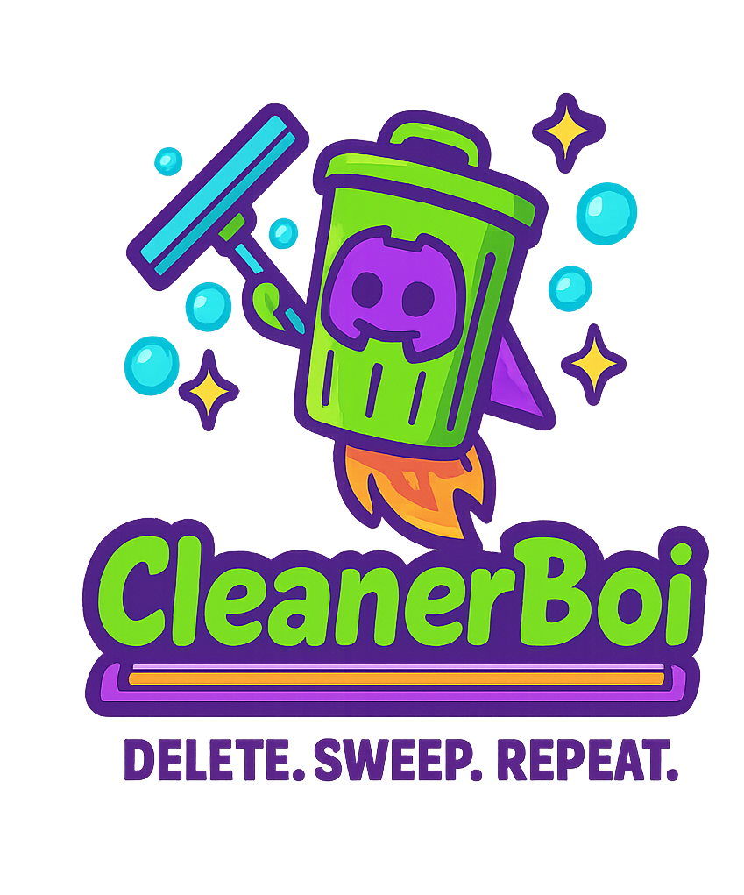

# Discord Cleaner Bot

A Discord bot that automatically cleans messages in specified channels after a certain period of time.

<p align="center">
  
</p>

## Features

- Automatically delete messages in specified channels after a set amount of time.
- Different cleaning intervals per channel (persisted in `cleaner_state.json`).
- Manual test runs, including precise ranges like `last5m`, `last1h25m`, `last2d`, etc.
- Safe **hard stop**: `!disablecleaner` cancels any in-flight deletion and removes the channel’s schedule immediately.
- Permission checks: only users with specific roles can run commands; bot also verifies it has **Manage Messages** in the target channel.
- Scheduled cleanup runs every **15 minutes** by default. First run after enabling is delayed by one interval (prevents surprise immediate sweeps).
- Basic spam protection with command cooldowns.

## Prerequisites

- A server (e.g. Raspberry Pi) to run the bot
- **Python 3.10+**
- Linux recommended (tested on Raspberry Pi OS)
- A Discord Application & Bot set up in the Discord Developer Portal (see below)

## Installation

1. Ensure Python and pip are installed:
    ```sh
    sudo apt update
    sudo apt install python3 python3-pip
    ```

2. Clone this repository:
    ```sh
    git clone https://github.com/hitem/CleanBot.git
    cd CleanBot
    ```

3. Create and activate a virtual environment:
    ```sh
    python3 -m venv venv
    source venv/bin/activate
    ```

4. Install `pipenv` within the virtual environment:
    ```sh
    pip install pipenv
    ```

5. Install the required Python packages using `pipenv`:
    ```sh
    pipenv install
    ```

6. Create a `.env` file following the format of `.env_example`.  
   Add your `DISCORD_BOT_TOKEN` (make sure you’ve completed the Developer Portal setup).

7. Run the bot:
    ```sh
    pipenv run python3 CleanBotman.py
    ```

## Running as a Service

Run your bot as a systemd service so it restarts on boot/crash.

1. Create a systemd service file:
    ```sh
    sudo nano /etc/systemd/system/discord-cleaner-bot.service
    ```

2. Add the following content (change `/path/to/your/` and `your_username`):
    ```ini
    [Unit]
    Description=Discord Cleaner Bot
    After=network.target

    [Service]
    Type=simple
    User=your_username
    WorkingDirectory=/path/to/your/CleanBot
    ExecStart=/bin/bash -c 'source /path/to/your/CleanBot/venv/bin/activate && pipenv run python3 /path/to/your/CleanBot/CleanBotman.py'
    Restart=on-failure
    StandardOutput=journal
    StandardError=journal

    [Install]
    WantedBy=multi-user.target
    ```

3. Reload systemd:
    ```sh
    sudo systemctl daemon-reload
    ```

4. Enable on boot:
    ```sh
    sudo systemctl enable discord-cleaner-bot
    ```

5. Start now:
    ```sh
    sudo systemctl start discord-cleaner-bot
    ```

6. Check status/logs:
    ```sh
    sudo systemctl status discord-cleaner-bot
    sudo journalctl -u discord-cleaner-bot -f
    ```

## Commands

> **Notes**
> - Where a channel argument is accepted, you can pass a **channel mention** (e.g. `#general`) or a **channel ID**. If omitted, the command targets the **current channel**.
> - The bot will refuse to enable cleaning in a channel if it lacks the **Manage Messages** permission there.

- `!enablecleaner [#channel]`  
  Enable the cleaner for the specified channel (or the current channel if omitted).  
  Default cleaning interval is **24 hours**.

- `!disablecleaner [#channel]`  
  Disable the cleaner for the specified/current channel.  
  **Hard stop:** cancels any ongoing manual or scheduled deletions and removes the schedule immediately.

- `!setcleaningtime HOURS`  
  Set the automatic cleaning threshold for the **current** channel.  
  `HOURS` must be between **1** and **72**.

- `!testcleaner TIME`  
  Manually run a one-off cleanup in the **current** channel. `TIME` can be:
  - `all` — delete **all** messages in the channel  
  - A number of hours, e.g. `12` — delete messages **older than** 12 hours  
  - A “last duration” string: `last<Nd><Nh><Nm>` — delete messages from the **last** duration  
    - Examples: `last5m`, `last45m`, `last1h25m`, `last2d`  
  - You can interrupt an in-flight run with `!disablecleaner`.

- `!cleanersetting`  
  Show whether the cleaner is enabled for the current channel and the current interval (in hours).

- `!listchannels`  
  List all text channels and their IDs in the current server (guild).

- `!checkpermissions`  
  Display your guild permissions (useful for debugging role issues).

- `!cleanerhelp`  
  Show a summary of all commands.

## How it Works

- The bot stores per-channel settings in `cleaner_state.json`.  
  On startup, it **validates** those channels exist; any stale IDs are removed from the file automatically.
- The scheduled sweep runs every **15 minutes**. When you enable a channel, the **first** scheduled sweep is delayed by one interval to prevent accidental immediate deletion.
- Manual runs (`!testcleaner …`) and scheduled sweeps are **interruptible**: `!disablecleaner` will cancel them mid-scan or mid-delete.

## Logging

The bot logs to the systemd journal (when run as a service).  
Tail logs live:
```sh
sudo journalctl -u discord-cleaner-bot -f
```

## Discord Developer Portal Setup

1. Go to the Discord Developer Portal: https://discord.com/developers/applications  
2. Click **New Application**, name it, and create.  
3. (Optional) For a private bot, in **OAuth2** set the install to **Guild Install** only.  
4. Go to the **Bot** tab.  
5. (Optional) For a private bot, untick **Public Bot**.  
6. Under **Token**, copy your bot token — this becomes `DISCORD_BOT_TOKEN` in your `.env`.  
7. Under **Privileged Gateway Intents**, enable **Message Content Intent**.  
8. Save changes.

### Invite the Bot to Your Server

1. In **OAuth2 → URL Generator**:  
   - Under **SCOPES**, select **bot**.  
   - Under **BOT PERMISSIONS**, select:  
     - `Manage Messages`  
     - `Read Messages`  
     - `Send Messages`  
     - `View Channels`  
     - `Read Message History`  
2. Copy the generated URL, open it, choose your server, and authorize.

## Troubleshooting

- **PyNaCl warning:**  
  If you see `PyNaCl is not installed, voice will NOT be supported` — safe to ignore (this bot doesn’t use voice).

- **No deletions happen:**  
  Ensure the bot has **Manage Messages** in that channel, and that the cleaner is enabled there (`!cleanersetting`).

- **Accidental long runs:**  
  Use `!disablecleaner` to halt any in-flight deletions and remove the schedule immediately.
